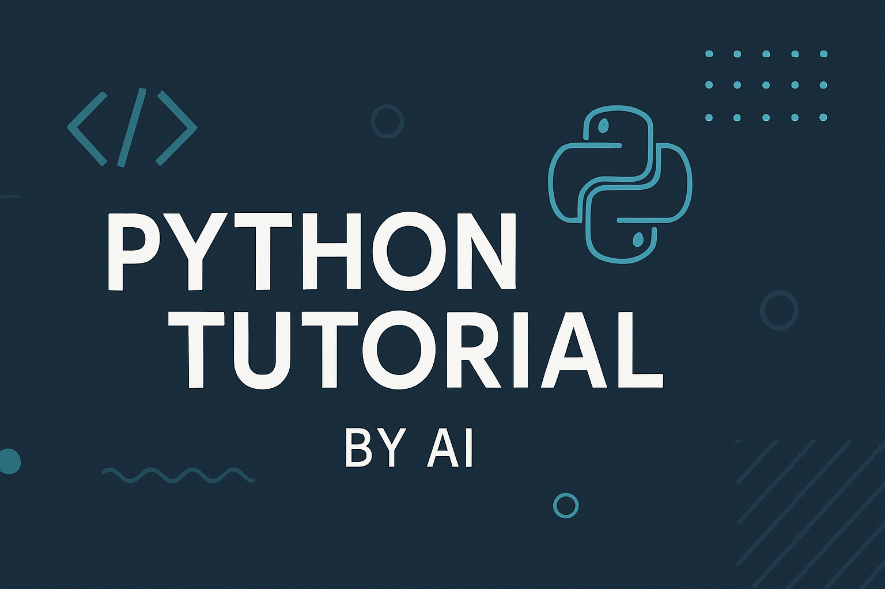

# Python Tutorial by AI

[中文版](README_zh.md)



Welcome to this interactive Python tutorial! This course is designed to take you from a complete beginner to a proficient Python developer, equipped with modern tools and best practices.

## How It Works

The tutorial is divided into 53 lessons, each covering a specific topic. Each lesson has its own directory containing two files:

*   `instructions.md`: A Markdown file with the lesson's content, explanations, and examples.
*   `exercise.py` (or `main.py` for FastAPI): A Python file with practice exercises for you to complete.

---

## 🚀 Environment Setup (Start Here if You're Brand New!)

Before you can run any Python code, you need to set up your development environment. Follow these steps based on your operating system.

### Step 1 — Install Python

> **Recommended:** Install Python **3.11 or higher**.

#### Windows
1. Go to [https://www.python.org/downloads/](https://www.python.org/downloads/) and download the latest Python installer.
2. Run the installer. **Important:** Tick the checkbox **"Add Python to PATH"** before clicking Install.
3. Open **Command Prompt** (search "cmd" in the Start menu) and verify:
   ```bash
   python --version
   ```

#### macOS
1. Open **Terminal** (search "Terminal" in Spotlight with `Cmd + Space`).
2. The easiest way is via [Homebrew](https://brew.sh/). If you don't have Homebrew, install it first:
   ```bash
   /bin/bash -c "$(curl -fsSL https://raw.githubusercontent.com/Homebrew/install/HEAD/install.sh)"
   ```
3. Then install Python:
   ```bash
   brew install python
   ```
4. Verify the installation:
   ```bash
   python3 --version
   ```

#### Linux (Ubuntu / Debian)
1. Open your **Terminal**.
2. Run:
   ```bash
   sudo apt update && sudo apt install python3 python3-pip -y
   ```
3. Verify:
   ```bash
   python3 --version
   ```

---

### Step 2 — Install a Code Editor

A good code editor makes writing Python much easier. We strongly recommend **Visual Studio Code (VS Code)**:

1. Download VS Code from [https://code.visualstudio.com/](https://code.visualstudio.com/).
2. Install the **Python extension** by Microsoft (search "Python" in the Extensions panel on the left sidebar).
3. Install the **Pylance** extension for better code intelligence and autocompletion.

> **Tip:** Once VS Code is open, press `Ctrl+` `` ` `` (Windows/Linux) or `Cmd+` `` ` `` (macOS) to open the built-in terminal — you can run all your Python commands from there without leaving the editor.

---

### Step 3 — Get This Course

**Option A — Download as a ZIP (easiest for beginners):**
1. Click the green **Code** button at the top of this GitHub page.
2. Select **Download ZIP**, then unzip the folder to a location of your choice.
3. Open VS Code, go to **File → Open Folder**, and select the unzipped folder.

**Option B — Clone with Git (recommended if you know Git):**
```bash
git clone https://github.com/unrealandychan/learn-python-with-ai.git
cd learn-python-with-ai
```

---

### Step 4 — (Optional but Recommended) Install `uv` for Dependency Management

`uv` is a blazing-fast Python package manager used in Lesson 50. Installing it early lets you easily install third-party packages used in later lessons.

```bash
# macOS / Linux
curl -LsSf https://astral.sh/uv/install.sh | sh

# Windows (PowerShell)
powershell -ExecutionPolicy ByPass -c "irm https://astral.sh/uv/install.ps1 | iex"
```

After installing, create a virtual environment in the course folder:
```bash
uv venv
```
Then activate it:
```bash
# macOS / Linux
source .venv/bin/activate

# Windows
.venv\Scripts\activate
```

---

## Getting Started

1.  **Navigate to a lesson directory:** Start with `lesson_01_intro_to_python`.
2.  **Read the instructions:** Open the `instructions.md` file to learn about the topic.
3.  **Complete the exercise:** Open `exercise.py` and write your code to complete the exercises.
4.  **Run your code:** In your terminal, run the exercise file using:

    ```bash
    python lesson_01_intro_to_python/exercise.py
    ```

    > On macOS/Linux you may need to use `python3` instead of `python`.

5.  **Check your solution:** If you get stuck, peek at `solution.py` in the same folder — but try the exercise yourself first!

### Tips for Beginners

*   **Don't rush.** Focus on understanding each lesson before moving to the next.
*   **Type the code by hand** rather than copy-pasting — it builds muscle memory.
*   **Experiment freely.** Change values in the examples and see what happens. Breaking things is part of learning!
*   **Use AI as a tutor.** If something is confusing, ask an AI assistant (like GitHub Copilot or ChatGPT) to explain it in simpler terms.
*   **Read error messages carefully.** Python's error messages tell you exactly what went wrong and on which line — they are your friend, not your enemy.

## Beginner Lessons

*   **Lesson 01: Intro to Python** — Install Python, set up your environment, and write your first "Hello, World!" program.
*   **Lesson 02: Variables & Data Types** — Learn about integers, floats, strings, and booleans.
*   **Lesson 03: Basic Operators** — Arithmetic, comparison, and logical operators.
*   **Lesson 04: User Input & Type Casting** — Read input from users and convert between data types.
*   **Lesson 05: Conditional Statements** — Control flow with `if`, `elif`, and `else`.
*   **Lesson 06: Lists** — Create lists, access elements by index, and use slicing.
*   **Lesson 07: List Methods** — Mutate and manipulate lists with built-in methods.
*   **Lesson 08: For Loops** — Iterate over lists and ranges with `for` loops.
*   **Lesson 09: While Loops** — Repeat code while a condition is true.
*   **Lesson 10: Dictionaries** — Store and retrieve key-value pairs.
*   **Lesson 11: Tuples & Sets** — Immutable sequences and unordered unique collections.
*   **Lesson 12: Defining & Calling Functions** — Reuse code by writing your own functions.
*   **Lesson 13: Function Arguments & Return Values** — Positional, keyword, and default arguments; returning data.
*   **Lesson 14: Variable Scope** — Understand local vs. global scope and the `global` keyword.
*   **Lesson 15: Modules & Importing** — Use the standard library and import your own modules.
*   **Lesson 16: File I/O Reading** — Open and read text files with Python.
*   **Lesson 17: File I/O Writing** — Write and append data to files.
*   **Lesson 18: Error Handling** — Catch and handle exceptions with `try`, `except`, and `finally`.
*   **Lesson 19: OOP Intro** — Introduction to classes, objects, attributes, and methods.
*   **Lesson 20: Next Steps** — Review your progress and explore project ideas to keep learning.

## Advanced Lessons

*   **Lesson 21: OOP Inheritance** — Extend classes and reuse code through inheritance.
*   **Lesson 22: OOP Polymorphism** — Override methods and use polymorphism for flexible code.
*   **Lesson 23: OOP Encapsulation** — Control access with public, protected, and private attributes.
*   **Lesson 24: OOP Dunder Methods** — Customise objects with magic methods like `__str__` and `__len__`.
*   **Lesson 25: Static and Class Methods** — Use `@staticmethod` and `@classmethod` decorators.
*   **Lesson 26: List Comprehensions** — Write concise list transformations in a single expression.
*   **Lesson 27: Dict and Set Comprehensions** — Apply the comprehension pattern to dictionaries and sets.
*   **Lesson 28: Lambda Functions** — Create small anonymous functions with `lambda`.
*   **Lesson 29: Map Filter Reduce** — Functional-style data processing with `map()`, `filter()`, and `reduce()`.
*   **Lesson 30: Generators** — Produce values lazily with generator functions and the `yield` keyword.
*   **Lesson 31: Decorators** — Wrap and enhance functions using decorators.
*   **Lesson 32: Collections Module** — Powerful container types: `Counter`, `defaultdict`, `deque`, and more.
*   **Lesson 33: Dates and Times** — Parse, format, and calculate dates and times with the `datetime` module.
*   **Lesson 34: JSON Data** — Serialize and deserialize JSON data with the `json` module.
*   **Lesson 35: OS and Sys Modules** — Navigate the filesystem and interact with the OS using `os` and `sys`.
*   **Lesson 36: Multithreading** — Run tasks concurrently with the `threading` module.
*   **Lesson 37: Multiprocessing** — Achieve true parallelism with the `multiprocessing` module.
*   **Lesson 38: Asyncio Intro** — Understand the event loop and the basics of `asyncio`.
*   **Lesson 39: Async Await** — Write clean asynchronous I/O code with `async` and `await`.
*   **Lesson 40: Advanced Project** — Build a capstone project that combines everything you've learned.

## Essential Python Packages

*   **Lesson 41: Requests Module** — `requests` - Make HTTP requests to APIs and websites.
*   **Lesson 42: BeautifulSoup4** — `BeautifulSoup4` - Parse HTML and scrape web pages.
*   **Lesson 43: Pandas** — `pandas` - Powerful data analysis and manipulation.
*   **Lesson 44: Matplotlib** — `matplotlib` - Create charts and data visualisations.
*   **Lesson 45: Seaborn** — `seaborn` - High-level statistical data visualisation.
*   **Lesson 46: FastAPI** — `FastAPI` - Build high-performance web APIs with automatic docs.

## Professional Development Practices

*   **Lesson 47: Git and GitHub** — Track changes and collaborate using Git & GitHub.
*   **Lesson 48: Pytest** — Write and run automated tests with `pytest`.
*   **Lesson 49: Ruff** — Keep code clean with fast formatting and linting via `ruff`.
*   **Lesson 50: UV Dependency Management** — Manage virtual environments and dependencies with `uv`.
*   **Lesson 51: Databases** — Store and query data with `SQLAlchemy` and `SQLite`.
*   **Lesson 52: Config Management** — Manage secrets and settings safely using `.env` files.
*   **Lesson 53: Python for MCP and Skills** — Build a mini MCP-style tool router and reusable skills in Python.

---

Happy learning! 🎉